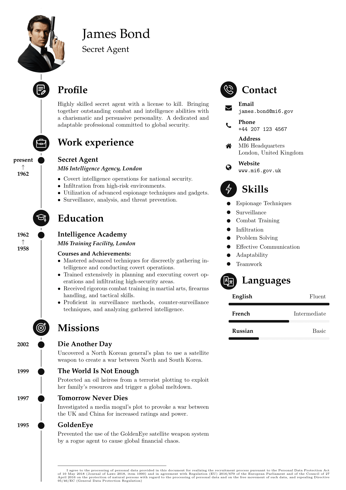

# BubbleCV Template

This is a professional CV template inspired by the legendary secret agent James Bond.
BubbleCV is designed to effectively showcase your skills, work experience, education, and contact information in a sleek and impactful manner.

## Key Features

- Personal Image – The template allows you to include a personal image in your CV, adding a touch of professionalism and personalization.

- Timeline – You can use the timeline feature to display the dates of your employment history or educational background, providing a clear and organized overview.

- Fully Customizable – With just a single parameter, you can change the size of all elements in the template. This flexibility allows you to manipulate your CV to accommodate all the necessary information on single page. Additionaly, all elements are parameterized, enabling you to adjust margins, spaces, and column ratio effortlessly.

- Easy Extensibility – You have the option to upload your own [resources](resources/), such as icons, to further personalize your CV and make it unique to your style.

- Configurable Colors – The bubbles and icons in the template can be easily changed with a single line of code. By adjusting the RGB color parameters, you can customize the appearance to suit your preferences.

- Functionalities for Content Management – The template provides functions that facilitate the easy addition of features and the management of content, ensuring a seamless CV creation process.

Feel free to explore and make use of the BubbleCV Template to create a standout CV that captures the attention of potential employers or clients.
Open the template in [Overleaf](https://www.overleaf.com/latex/templates/bubblecv/bcynnjktwqsx) and start working on your own resume.

## Functions

- `\begin{cv}[<avatar>][<avatar_scale>][<avatar_color>]{<name>}{<description>}`: Creates the main CV environment with optional parameters for avatar image, scale, and color. It also includes the name and description of the individual.

- `\cvsection[<icon>][<icon_scale>][<icon_color>]{<section_title>}`: Creates a new section with an optional icon, scale, and color parameters. It helps in organizing different parts of the CV, such as Profile, Work Experience, Education, etc.

- `\begin{cvevent}[<start_date>][<end_date>]`: Begins a new work experience or educational event. Optional start and end dates can be specified to indicate the duration of the event.

- `\cvname{<name>}`: Displays the name of the event.

- `\cvdescription{<description>}`: Provides a brief description of the work experience or educational event.

- `\cvsidebar`: Changes the column from the main to the sidebar.

- `\cvitem[<fa_icon>][<fa_icon_scale>]`: Creates an item in the sidebar with an optional icon and scale parameter. The full list of FontAwesome icons is available at [this link](https://mirrors.ibiblio.org/CTAN/fonts/fontawesome/doc/fontawesome.pdf).

- `\cvskill{<skill>}{<level_name>}{<level_value>}`: Displays a skill and its corresponding proficiency level.

- `\cvseparator[<spacing>]`: Inserts a 1mm vertical space. An optional parameter can be provided to specify the number of repetitions, allowing you to adjust the spacing as needed.

## License

This CV template is provided under the [Creative Commons CC BY 4.0](LICENSE) license. You are free to use, modify, and distribute the template for personal or professional purposes, as long as you acknowledge the original source.

## Contribution

Contributions are very welcome.
Please ensure the proposed feature/bugfix works fine with pdflatex engine before you submit a merge request.

## Issues

If you encounter any problems, please leave [issue](../../issues/new), along with a detailed description.
